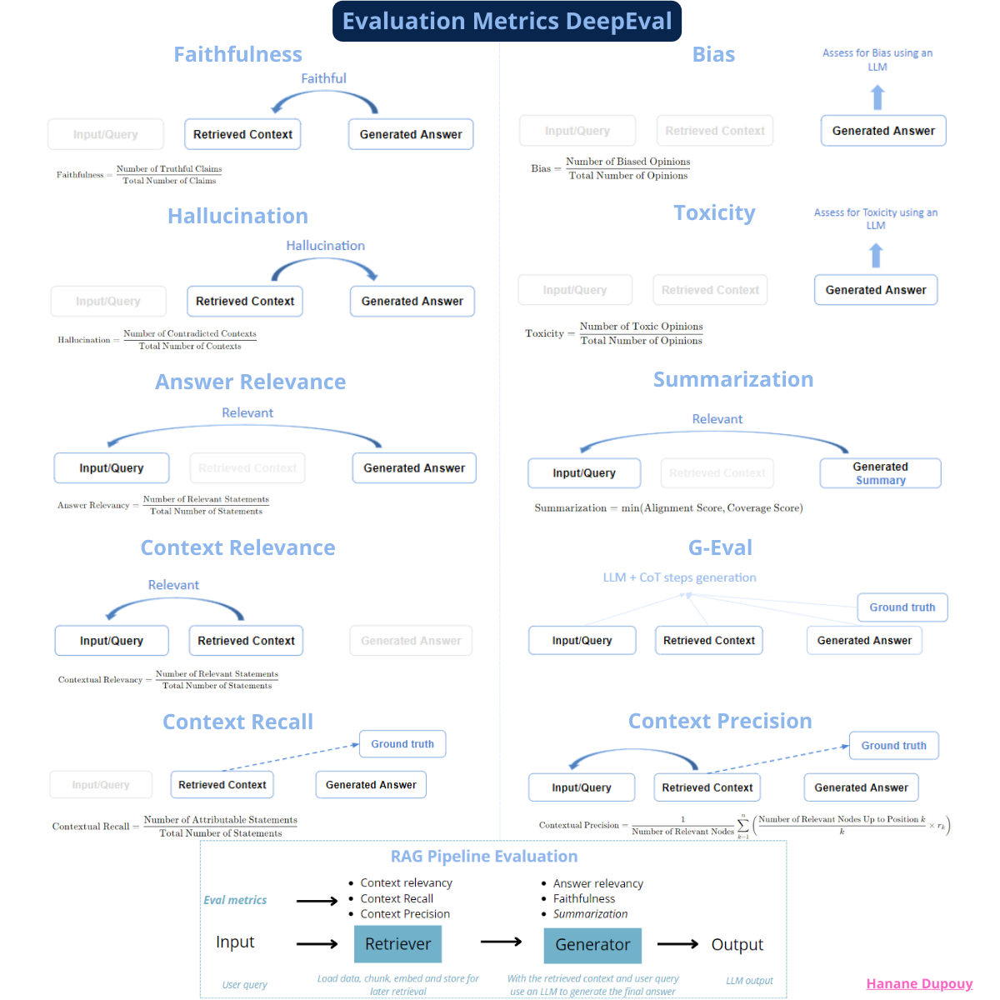

# How to evaluate your LLM applications?

One of the frameworks you can use is DeepEval.

DeepEval is an open-source framework for evaluating LLM applications (RAG pipelines, Fine-tuning,..), making it easy to develop and refine these applications. 

These metrics can be used on RAG pipelines and on fine-tuning tasks with or without access to the ground truth (GT). Each metric comes with a score and a reason explaining the score.

https://docs.confident-ai.com/docs/getting-started

## 👉RAG/No (GT) metrics: 
* Answer Relevance: This assesses how relevant the generated answer from the LLM is to the input query.

* Context Relevancy: This evaluates how relevant the retrieved context is to the input query.

* Faithfulness: This evaluates the factual consistency of the generated answer relative to the provided context.

* Hallucination: This is very close to Faithfulness.
It focuses on identifying contradictions between the generated answer and the retrieved context, similar to Faithfulness but with a distinct emphasis.

* Summarization (Specific Task metric): It determines whether the LLM generates correct summary while disclosing the necessary details from the original text.

* G-Eval (Custom Criterion): G-Eval is a framework that uses LLMs with chain-of-thoughts (CoT) to evaluate LLM outputs based on ANY custom criteria.

* Bias: It assesses whether your LLM output exhibits gender, racial, or political bias. Bias: Gender, political, racial/ethnic, Geographical.

* Toxicity: It determines whether the LLM generates answer containing toxicity: Personal attacks, mockery, hate, dismissive statements, threats or intimidation.

## 👉Ground Truth metrics:
* Context Recall: This evaluates to which extend the retrieved context aligns with the annotated answer which represents the ground truth.

* Context Precision: It measures whether nodes or chunks in the retrieved context that are relevant to the given input based on information in the ground truth, are ranked higher than the irrelevant ones.

## 👉 How these metrics are calculated:
- All these metrics use an LLM alongside designated prompts to extract statements/claims from the element you want to evaluate in your LLM application, 𝘴𝘶𝘤𝘩 𝘢𝘴 𝘵𝘩𝘦 𝘨𝘦𝘯𝘦𝘳𝘢𝘵𝘦𝘥 𝘢𝘯𝘴𝘸𝘦𝘳.
- And then they assert whether the extracted information (Statement/claim) is aligned with or can be inferred from the 𝘳𝘦𝘵𝘳𝘪𝘦𝘷𝘦𝘥 𝘤𝘰𝘯𝘵𝘦𝘹𝘵 𝘧𝘰𝘳 𝘦𝘹𝘢𝘮𝘱𝘭𝘦.
- Then, a verdict is provided by the LLM (yes, no, idk). And then a score is computed based on this verdict.

## 👉Let's take an example: 
* For Faithfulness: 
 - It uses an LLM to break the generated answer into claims. 
 - Then uses this same LLM to classify either these claims are aligned and present in the facts included in the retrieved context.
 - A verdict is provided by the LLM: yes, no, idk
 - Faithfulness score is then calculated: Number of Truthful Claims (!no verdict) / Total number of Claims (extracted from the generated answer).

